# unity
INTRODUÇÃO
O jogo se trata de um carro que tem de passar por obstaculos e o objetivo final é chegar ao final do percurso

CENARIO
O cenario é uma cidade com predios, casas e comercios, é uma pista com obstaculos

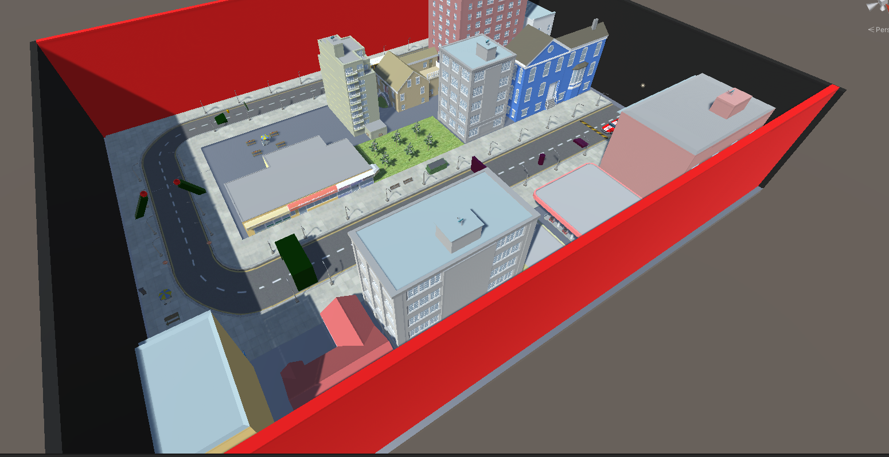
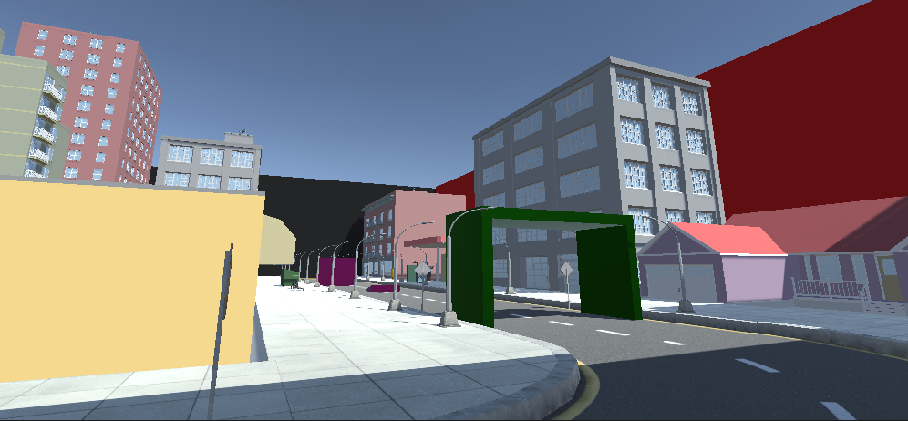
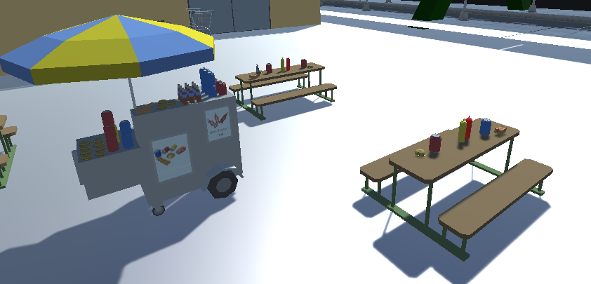
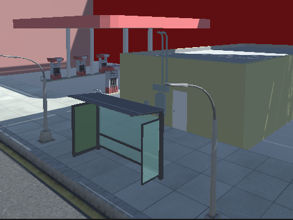

Personagem
O personagem é um carro da asset store, que tem movimentos de ir pra frente e para tras e rotacionar para os lados

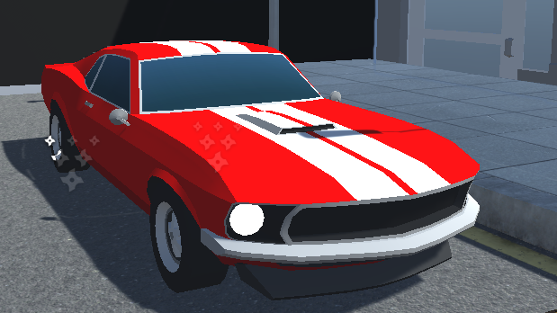
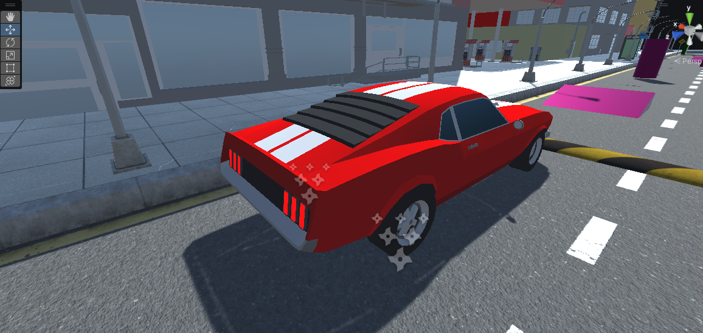
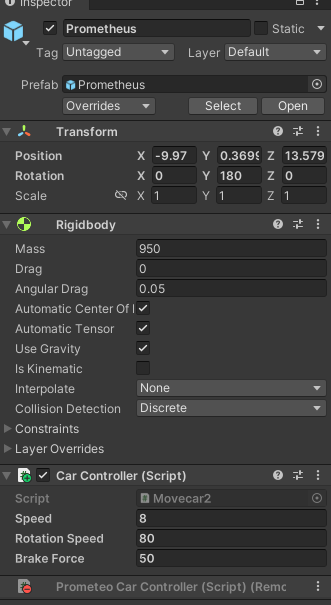

gameobjects
os game objects sao usados como obstaculos ao longo do percurso

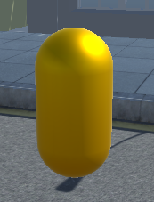
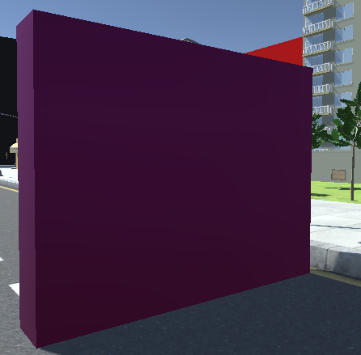
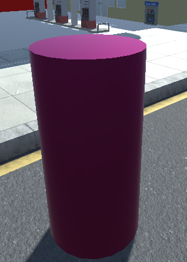

materials
os materiais foram usados para colorir os gameobjects

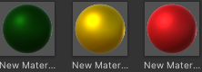

script
no script é feito o movimento das rodas de tras, a rotação para os lados com as rodas da frente e configurado o freio com a tecla espaço

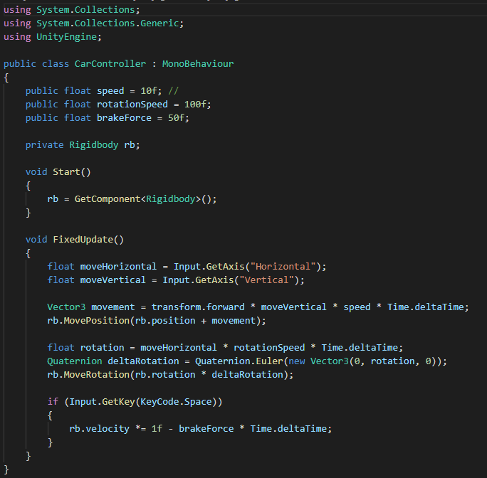

link do projeto pelo google drive: https://drive.google.com/file/d/1W-4famdJ4-5ay6yapyNjUoOFqz6Gt7Q-/view?usp=sharing
